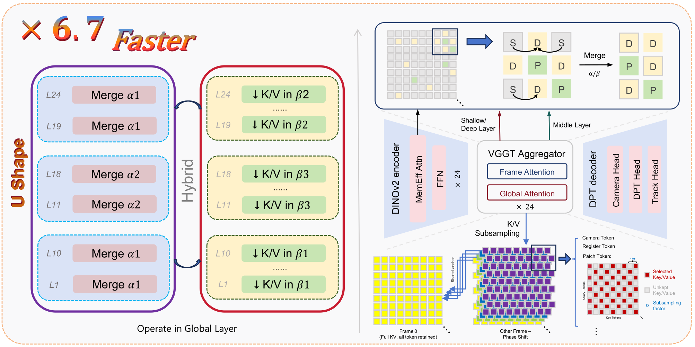
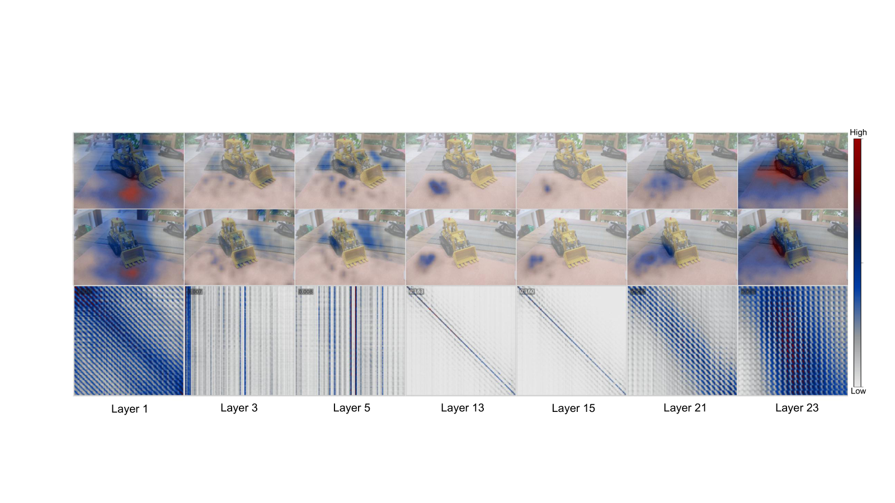
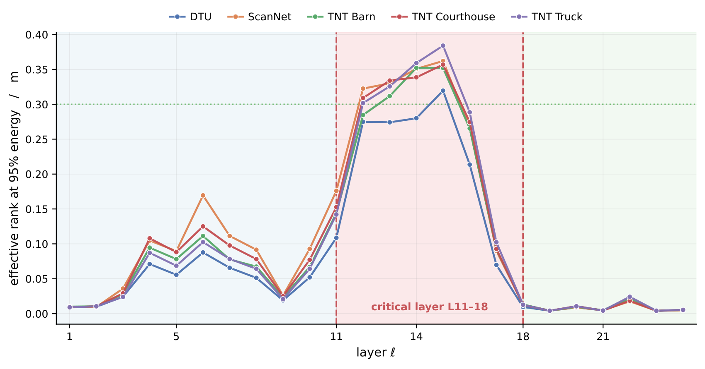
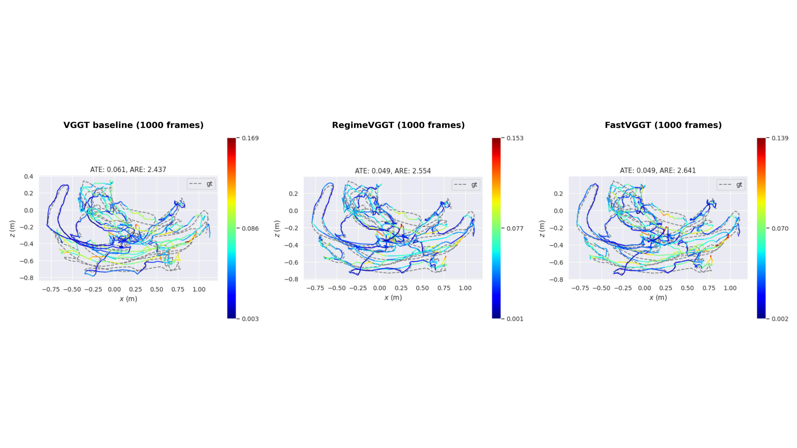

# RegimeVGGT

**Training-free acceleration for VGGT via a layer-wise rank-band prior.**

> Anonymous code release for NeurIPS 2026 submission. Author information
> and original repository links are intentionally omitted for double-blind
> review.

<p align="center">
  
</p>

---

## Abstract

Visual Geometry Grounded Transformer (VGGT) recovers dense 3D scene
structure from multi-view images in one forward pass, but quadratic
cross-frame attention limits its scalability. Existing training-free
accelerators reduce computation uniformly along one axis, missing layer
heterogeneity. Our spectral, probing, and causal analyses reveal three
regimes: shallow layers lack cross-view structure, middle layers drive
cross-view alignment, and deep layers are redundant for dense geometry
yet their cross-frame attention remains essential for pose. RegimeVGGT
applies layer-wise U-shaped compression along two axes: *Saliency-Guided
Banded Merging* protects geometry- and edge-salient tokens, while
*Selectively Protected K/V Downsampling* preserves cross-frame spatial
coverage and the pose-critical path through a phase-shifted spatial
grid, a reference-frame anchor, and uncompressed camera/register tokens.
Training-free, RegimeVGGT achieves a **6.7×** speedup over VGGT* at
matched reconstruction quality.

| Benchmark                       | Metric          | Result               |
|---------------------------------|-----------------|----------------------|
| Tanks & Temples (kf=1, 6 scenes)| AUC@30 / time   | 0.9105 / 111s (5.01x)|
| ScanNet-50 (1000 input frames)  | Chamfer / time  | 0.472 / 71.7s        |

---

## Why three bands?

Two independent diagnostics on stock VGGT's 24 aggregator layers identify the
same **shallow / middle / deep** partition that RegimeVGGT exploits.

<p align="center">
  
  <br>
  <em>Cross-frame attention is diffuse in shallow layers (L1, 3, 5),
  localized along the correspondence diagonal in the middle band (L13, 15),
  and collapsed in deep layers (L21, 23).</em>
</p>

<p align="center">
  
  <br>
  <em>Effective rank of the global-attention matrix is universally
  inverted-U-shaped, peaking at the middle band L11–L18. Shallow and deep
  flanks are nearly rank-1 (compressible); the middle band requires denser
  K/V support to preserve cross-view correspondence.</em>
</p>

The acceleration policy follows the rank profile: aggressive merge in the
shallow + deep flanks, conservative merge with full K/V support in the
middle band, and protected geometry-token / register / frame-0 keys
throughout.

---

## Qualitative pose on long sequences

<p align="center">
  
  <br>
  <em>Predicted camera trajectories on ScanNet-50 <code>scene0648_01</code>
  under 1000-frame inference. Left: VGGT* baseline. Center: RegimeVGGT.
  Right: FastVGGT. Predictions colored by per-frame ATE; ground truth in
  gray. RegimeVGGT preserves global loop closure at <strong>5×</strong> the
  speed of VGGT*.</em>
</p>

---

## Installation

```bash
pip install -r requirements.txt
```

Tested on a single NVIDIA H800 80 GB with PyTorch 2.1+, CUDA 11.8+, Python 3.10+..

## Checkpoint

RegimeVGGT uses the **model_tracker_fixed_e20** checkpoint with no
fine-tuning — the upstream weights with the tracking head attached,
distributed by Meta on Hugging Face.

```bash
# create a folder and download the model_tracker_fixed_e20.pt checkpoint
mkdir -p ckpt
wget -P ckpt \
    https://huggingface.co/facebook/VGGT_tracker_fixed/resolve/main/model_tracker_fixed_e20.pt
```

You can also point `CKPT` directly at any path that holds the file
(e.g., a shared cache):

```bash
export CKPT=/shared/cache/vggt-1b/model_tracker_fixed_e20.pt
```

The checkpoint is subject to the original VGGT license; see
<https://huggingface.co/facebook/VGGT_tracker_fixed>.

---


## Reproduce paper numbers

Reproduction entry points live in `scripts/`. Each reads dataset paths
and `CKPT` from environment variables — no hardcoded paths, no CLI
argument needed.

```bash
# 7Scenes + NRGBD dense reconstruction (Tables 1 & 2)
SEVEN_ROOT=/path/to/7scenes \
NRGBD_ROOT=/path/to/nrgbd \
CKPT=ckpt/model_tracker_fixed_e20.pt \
    bash scripts/eval_7andn.sh
```

Each run writes `summary.json` and `logs.txt` under
`results/regimevggt/<dataset>/`.

To compare against uncompressed VGGT*, pass `--method baseline` to the
underlying `eval/*.py` script (the shell wrappers default to RegimeVGGT).

---

## Repository layout

```
RegimeVGGT/
├── README.md                  # this file
├── LICENSE
├── requirements.txt
├── image/                     # paper figures referenced above
├── methods/
│   ├── regimevggt.py          # main aggregator: token merge x K/V phase-shift
│   └── fastvggt_merge.py      # ToMe bipartite-2d primitive
├── vggt/                      # forked VGGT-1B model_tracker code (aggregator + heads)
├── eval/
│   ├── eval_pose_tnt.py       # T&T 6-scene pose
│   ├── eval_7andN.py          # 7Scenes + NRGBD dense reconstruction
│   └── eval_scannet50.py      # ScanNet-50 long-sequence (CD + pose)
└── scripts/
    ├── eval_tnt.sh            # T&T pose, env-var-driven
    ├── eval_7andn.sh          # 7Scenes + NRGBD dense recon
    └── eval_scannet.sh        # ScanNet-50
```

---

## License

Apache-2.0. See `LICENSE`. The VGGT-1B model_tracker weights and the
original VGGT model code under `vggt/` are subject to the upstream VGGT
license.

---

